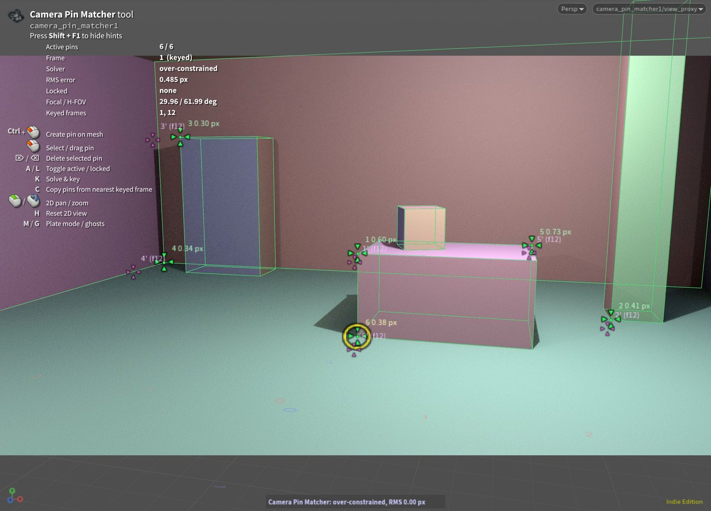
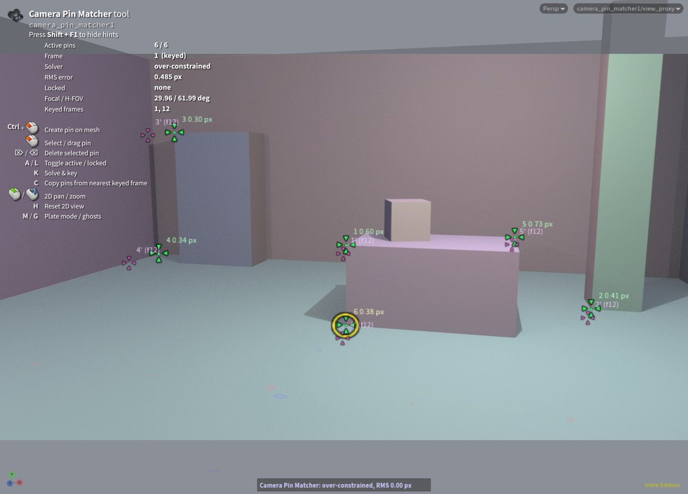

# Camera Pin Matcher (Houdini 22)

Match a camera to existing scene geometry by pinning mesh points onto a plate. Each pin is a
3D point on a reference mesh plus a 2D position on the plate; you drag pins onto the matching
plate features in the viewport and a solver moves, rotates and zooms the camera until they
line up. The same workflow as Nuke's PointsTo3D or fSpy, but interactive in the Houdini
viewport, with keys on the timeline for a rough matchmove.

**The geometry is never modified.** Only the target camera's `tx ty tz rx ry rz focal` are
written. The tool doesn't touch the reference object, its parents or anything upstream of it,
and a test verifies this with a checksum.

| Plate in background, mesh as wireframe | Plate over shaded mesh (50 %) |
|---|---|
|  |  |

Each pin shows a target marker (four arrows) where it sits on the plate, a dot where its 3D anchor
projects through the current camera, a residual line between the two, and its id and error in
pixels. Purple markers are ghost pins from the neighbouring pinned frames.

## Contents

```
otls/camera_pin_matcher.hdalc   the asset (OBJ level, embedded Python viewer state)
src/pinmatch.py                 asset PythonModule: camera model, solver, pin storage, keys, buttons
src/pinmatch_state.py           asset ViewerStateModule: the interactive tool
build_hda.py                    rebuilds the asset from src/ (hython build_hda.py)
scenes/pinmatch_test.hiplc      test scene: room mesh, ground-truth camera, camera to solve
scenes/plate/plate.####.jpg     24-frame plate rendered (Karma) from the ground-truth camera
tests/                          headless tests, GUI integration test, scene generator
dev/                            remote-control harness for a GUI Houdini (development only)
TESTLOG.md                      test results (ground truth comparison)
PLAN.md                         technical plan (solver formulation, design decisions)
DEVELOPMENT.md                  developer handoff: architecture, build/test loop, Houdini 22 gotchas
```

## Installation

Requirements: Houdini 22.0 (developed and tested on 22.0.368, macOS). You don't need extra
Python packages: `numpy` ships with Houdini. The tool uses no environment variables and no
hard-coded paths.

Install the asset in one of these ways:

* In Houdini, go to **Assets > Install Asset Library...** and pick
  `otls/camera_pin_matcher.hdalc`.
* Copy the file into `$HOUDINI_USER_PREF_DIR/otls/`.
* Make the repo a Houdini package: save
  `{"hpath": "/path/to/houdini-camera-tracker"}` as
  `$HOUDINI_USER_PREF_DIR/packages/camera_pin_matcher.json`. Houdini then scans the repo's
  `otls/` in every session.

The node is **Camera Pin Matcher** in the OBJ Tab menu.

Install the asset before you open `scenes/pinmatch_test.hiplc` on another machine or from
another checkout location. The .hip records the asset path of the machine it was saved on
(issue #2).

**License note:** the committed files were built with Houdini **Indie**, so they are Limited
Commercial files (`.hdalc`, `.hiplc`). The sources are license-neutral. To build files for your
own license (`.hda`/`.hip` with FX/Core, `.hdanc`/`.hipnc` with Apprentice), run:

```bash
hython build_hda.py
```

```bash
hython tests/make_test_scene.py --no-render
```

## Workflow

1. Create a **Camera Pin Matcher** node at `/obj`. On the **Setup** tab, set **Target Camera**,
   **Reference Geometry** (an object; its display SOP is used) and **Plate Image**
   (`$F` sequences are supported, for example `$HIP/plate/plate.$F4.jpg`). If you want the
   camera resolution to match the plate, turn on **Match Camera Resolution to Plate**.
2. Select the node, move the mouse over the viewport and press **Enter**, or click
   **Enter Pin Matcher Tool**. The viewport locks to the camera view and hides the reference
   object in that viewport only, since the tool draws it itself. The plate shows up at full
   resolution.
3. **Ctrl + drag** from a mesh corner to the matching feature on the plate. This creates the pin,
   snapped to the nearest mesh point within 20 px, and drags it in one gesture. The camera
   solves live while you drag:
   * With 1 pin, the camera pans and tilts to put the point on target.
   * With a 2nd pin, the first pin stays locked in the image and the camera rolls and zooms
     around it. It dollies instead if focal is locked.
   * From 3–4 pins on, the full pose is solved, and focal as well from 4–6+ pins.

   When you release the mouse, the camera is refined and keyed at the current frame
   (**Solve & Key on Mouse Release**). The HUD shows the solver status and the RMS error.
4. Use 4–6 or more well spread pins, at different depths if possible. Correct any pin by
   dragging it. Pins that are locked (**L**) can't be moved by accident. Pins that are inactive
   (**A**) stay visible but are ignored by the solver.
5. **Rough matchmove:** go to another frame. The prompt offers the pins of the nearest pinned
   frame; press **C** to copy them (same ids, same 2D positions), then drag them onto the plate
   and release, or press **K**. Ghost pins (**G**) show where each pin was on the previous and
   next pinned frame. Houdini interpolates the keys in between (`bezier()`, auto slopes);
   frames are not baked.

## Viewport, navigation and display

* **Locked view:** while the tool is active, the viewport looks through the target camera.
  Tumble, track and dolly are blocked:
  * The mouse wheel, the middle mouse button, Space and Alt + mouse-button drags are consumed
    and used for 2D navigation instead.
  * A watchdog puts the view back on the camera if anything else switches it.

  Leaving the tool (Esc or another tool) restores the viewport's camera, link setting and
  visible-object mask.
* **2D pan/zoom:** the mouse wheel zooms around the cursor, the middle mouse button pans, and
  **H** resets. This is a pure viewport zoom; see [How the view lock works](#how-the-view-lock-works).
* **Display modes (M or the Display tab):**
  1. Plate in the background with the mesh as a wireframe on top.
  2. Plate in the foreground at **Plate Opacity** (default 50 %) over a shaded mesh.

  Drawables draw the plate, the mesh, the pins and the HUD, so the tool's display doesn't
  depend on the viewport's shading or display settings.

## Hotkeys

The single-key actions are Houdini hotkey symbols in the tool's own context, so you can rebind
them in the Hotkey Editor. On macOS, Houdini's **Ctrl** is the **⌘** key.

| Key | Action |
|---|---|
| Ctrl + LMB (click / drag) on mesh | Create a pin (and drag it). The modifier is set in **Pins > Create Pin Modifier** |
| LMB on a pin | Select the pin; drag to move it. Live solve while dragging |
| LMB on empty space | Deselect |
| Del / Backspace | Delete the selected pin |
| A | Toggle the selected pin active / inactive |
| L | Toggle the selected pin locked |
| K | Solve & Key the current frame |
| C | Copy pins from the nearest pinned (keyed) frame |
| G | Show / hide ghost pins |
| M | Switch the plate mode (background ↔ foreground) |
| Mouse wheel / MMB drag | 2D zoom / pan of the view |
| H | Reset the 2D view |
| RMB | Tool menu: all the actions above, locks and presets, snapping mode, bulk pin operations, keyed frames |

## Tool options (asset parameters)

| Tab | Parameter | Meaning |
|---|---|---|
| Setup | Target Camera | The camera to solve. Only its `tx ty tz rx ry rz focal` are ever written |
| | Reference Geometry | The object the pins are anchored to. It is only read |
| | Plate Image | An image or `$F` sequence |
| | Match Camera Resolution to Plate | Sets the camera `res` to the plate's resolution (when entering the tool or when the plate changes) |
| | Enter Pin Matcher Tool | Makes the node current and enters the tool |
| Display | Plate Mode | Background with wireframe, or foreground over the shaded mesh |
| | Plate Opacity | Opacity of the plate in foreground mode (default 0.5) |
| | Mesh Wire Color | Colour of the wireframe |
| | Show Ghost Pins | Pins of the previous / next pinned frame |
| | Show Per-Pin Error | Adds the reprojection error in px to each label |
| Pins | Snap New Pins To | Points (default), Edges, or Free Surface Hit |
| | Create Pin Modifier | Ctrl, Shift, or Ctrl+Shift |
| | Copy Pins from Nearest Keyed Frame | Same as **C** |
| | Unlock All Pins / Deactivate All Pins | Apply to all frames. The RMB menu also has **Activate All** |
| | Delete Pins on Current Frame / Delete All Pins... | **Delete All** asks for confirmation |
| Solver | Lock TX TY TZ RX RY RZ Focal | Locked parameters are never changed by any solve |
| | Lock Roll (horizon) | Keeps the camera's roll around its view axis, whatever the rotate order |
| | Presets | Lock Focal/FOV · Nodal (Lock Position) · Lock Roll · Unlock All |
| | Focal Range | The solved focal is clamped to this range (default 5–1000, camera focal units) |
| | Minimal Change Weight | Strength of the pull toward the current camera (default 1). Higher keeps the camera steadier with few pins |
| | Solve & Key on Mouse Release | When off, dragging updates the camera live and only **Solve & Key** sets keys |
| | Solve & Key / Delete Keys on Current Frame / Keyed Frames... | **Keyed Frames...** lists keyed and pinned frames and jumps to the one you pick |

## Pin display

| Colour | Meaning |
|---|---|
| green arrows | active pin |
| grey | inactive pin (ignored by the solver) |
| orange | locked pin (can't be dragged, still solved) |
| yellow ring | selected pin |
| purple, smaller | ghost pin from the previous or next pinned frame (label `id' (fN)`) |

The label shows the pin id and, if enabled, its reprojection error in pixels. A pin whose anchor
is behind the camera shows `(behind camera)` and is left out of the solve.

The HUD shows:
* the number of active pins
* the frame and whether it is keyed or missing a plate
* the solver status: *under-constrained* (fewer independent constraints than free parameters;
  the minimal-change prior fills the rest), *solved* (exactly determined) or *over-constrained*
  (least squares)
* the RMS reprojection error in pixels
* the locked parameters, including protected ones
* the focal length and horizontal FOV
* the keyed frames

## Solver

* **Camera model:** the same as Houdini's camera. It uses focal, horizontal aperture, resolution,
  pixel aspect and screen window, with no lens distortion. The world matrix is
  `buildTransform(t, r, s, pivot…) · preTransform · parent`, orthonormalised the way Houdini
  orthonormalises cameras. The model matches `worldTransform()` to 2e-8 and VEX `toNDC()` to
  1e-6 for random rigs with scaled parents, pivots, pre-transforms and every transform and rotate
  order.
* **Variables:** the camera's own local parameters. Locks are therefore exact: a locked
  parameter is not a variable. Keys also stay continuous in Euler space. The parent and
  pre-transform are held constant, so results go straight back into local space.
* **Method:** Levenberg–Marquardt in numpy on the pixel reprojection error of the active pins,
  with focal solved as log f. A *minimal change* prior pulls toward the camera at the start of
  the drag. The prior is measured in pixel equivalents, with this stiffness order:
  pan/tilt < roll ≈ zoom < dolly < truck/pedestal. That order produces the few-pin behaviour
  described in the workflow. On release and on Solve & Key, a polish pass re-anchors the prior
  on the result, so a well-determined solve carries no prior bias.
* **Guards:**
  * Steps that would put a pin behind the camera are rejected.
  * Focal is clamped to the Focal Range.
  * Non-finite results are discarded.
  * Look-at, constraints, non-perspective cameras and cameras inside locked assets disable
    solving.
* **Speed:** about 5 ms per full solve with 30 pins. A live drag event, including camera writes,
  takes about 2 ms.

## Undo and safety

* Every pin edit and every solve is one undo step. Creating or dragging a pin, including the
  live solve and the key on release, is also a single step.
* The tool never writes a camera parameter that has an expression or channel reference, is
  locked (padlock) or is overridden by CHOP. It treats such parameters as locked, lists them in
  the HUD, and warns in the viewport and the status bar.
* The 2D view parameters are changed with undo disabled.

## How the view lock works

Houdini 22 has a native *Lock Camera/Light Tumbling* with *Allow 2D Pan & Zoom*, but only as a
UI action (`h.pane.gview.camlocktumble`); there is no Python API for it. Setting the viewport's
own 2D window through `viewtransform` makes an unlinked camera view detach a moment later.
Using the camera's screen window would change the camera. The asset therefore contains a
**view proxy camera** (`<node>/view_proxy`):

* Expressions make it mirror the target camera's world transform and lens (`origin()`, `ch()`).
* Its own screen window carries the tool's 2D pan/zoom.

The viewport looks through the proxy, unlinked. The image is exactly the target camera's image,
the target camera is never touched by viewing, and the camera menu shows
`camera_pin_matcher1/view_proxy`.

## Pin data

Pins are stored as JSON in the asset's hidden `pins` parameter, so they are saved with the .hip:

```json
{"version": 1, "next_id": 7,
 "frames": {"1": [{"id": 1, "p": [x, y, z], "uv": [u, v], "on": true, "lock": false}]}}
```

* `p`: the world-space anchor, fixed when the pin is created.
* `uv`: the 2D target in camera NDC (0–1, origin bottom-left, like `toNDC`), so it doesn't
  depend on resolution.
* `id`: stable across frames when pins are copied.

## Tests

```bash
hython tests/test_core.py
```

Camera model against Houdini, ground-truth recovery, locks, 1- and 2-pin behaviour, guards,
protected parameters, asset buttons, undo and resolution matching.

```bash
houdini -foreground tests/test_gui.py
```

Opens a GUI session, runs the tool on the test scene, writes `tests/gui_test_log.txt` and exits.
To run it in a session that is already open, see the `dev/` harness in DEVELOPMENT.md.

```bash
hython tests/make_test_scene.py
```

Rebuilds the test scene and re-renders the plate with Karma. `--no-render` keeps the existing plate.

The GUI test drives the live viewer state with mock UI events. Their rays come from the real
viewport (`mapToWorld`), so it covers everything below raw OS input: picking, snapping, live
solves, drawables, parameter writes, keys, undo and persistence. Synthetic Qt events don't reach
Houdini's viewer-state dispatch. See `TESTLOG.md` for the results.

## Known limitations

The [GitHub issues](https://github.com/robinbenito/houdini-camera-tracker/issues) track open
work and ideas; the numbers below refer to them.

* **Not tested with real mouse and keyboard input** (#1). Real input goes through Houdini's own
  dispatch, which the GUI test can't reach. In particular, whether Space + drag (the volatile
  view tool) is fully consumed or briefly tumbles before the watchdog snaps the view back
  depends on that dispatch (#3).
* On macOS, Houdini's **Ctrl** is expected to be **⌘**. If Ctrl + click doesn't create pins,
  switch **Create Pin Modifier** to Shift (#1).
* Pins are anchored to world positions fixed when they are created. Deforming or animated
  reference meshes are displayed at the current frame, but existing anchors don't follow
  them (#9).
* The solve uses only the pins of the current frame. There is no bundle adjustment across
  frames (#6) and no lens distortion (#5). One bad pin pulls the whole solve (#7).
* **Lock Roll** is a stiff constraint on the camera's roll relative to world +Y. It holds to
  about 1e-8 rad but is not an exact elimination. It isn't defined for cameras looking straight
  up or down (#8).
* The plate is loaded into memory per frame (about 60 ms for 1280×720), so scrubbing through
  4K plates is slow, and there is no OCIO view transform (#11).
* The view proxy appears in the viewport's camera menu (#4).
* Solving is disabled for cameras with look-at or constraints and for orthographic cameras (#15).
* Only tested on macOS with an Indie license. The files in this repository are Indie-licensed;
  rebuild them with the commands above for other license types (#16).

## Houdini 22 API notes

I checked these against the local H22 help and live hython/GUI sessions. Where Houdini's
behaviour differed from the docs or was unclear, this is what I found:

* `GeometryDrawable` Sprite:
  * An image given as a file path is displayed at no more than 512 px.
  * `max_resolution` only accepts **int** sequences, not the documented floats.
  * Full resolution works with an `ImageLayer` source together with `max_resolution` equal to
    the image size.
* `hou.loadImageDataFromFile` returns **linearised** values, and image layers are displayed
  as-is, so the tool re-encodes them to sRGB. Pixel-array image sources render white.
* Drawable parameter types:
  * `falloff_range` needs a plain tuple, not a `hou.Vector2`.
  * `TextDrawable` `color1` renders crisp only as a `hou.Color`; 4-tuples come out dim.
  * Parameters passed to `draw()` persist on the drawable.
* Viewport:
  * The viewport takes up camera parameter changes asynchronously. The tool re-applies
    `setCamera` after its own edits and whenever it detects a lag.
  * `mapToWorld` returns *(direction, origin)*.
* Embedded HDA states also need `ViewerStateInstall` and `ViewerStateUninstall` sections
  (`viewerstate.utils.register_pystate_embedded`).
* OBJ assets are wrapped in the standard Transform/Subnet switcher. The build hides those tabs.
